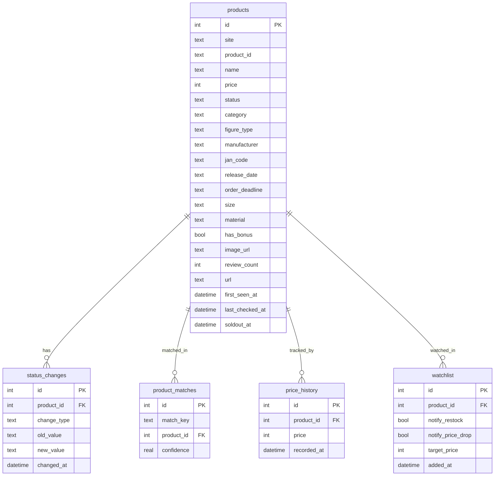

# Figure Website Scraper Phase 1 - Core Scraping Engine

## Overview

Build a Python scraper that monitors 5 Korean figure shopping malls (all Cafe24-based) for new products, restocks, and price changes. Store state in SQLite and run on a cron schedule. This is Phase 1 only — no OpenClaw integration, no Telegram bot, no Vault integration.

## Problem Statement

Korean figure collectors must manually check 5+ shopping malls daily to catch new releases, restocks, and deals. Products sell out fast — missing a restock by hours means waiting months. An automated scraper solves this by continuously monitoring all sites and detecting changes.

## Proposed Solution

A single Python application with a shared Cafe24 HTML parser base, site-specific adapters, SQLite state storage, and change detection logic. All 5 sites share the Cafe24 platform, so ~80% of parsing logic is reusable.

## Technical Approach

### Architecture

```
figure-scrapper/
├── requirements.txt
├── config.py                 # Site configs, URLs, intervals
├── db.py                     # SQLite schema init + CRUD operations
├── models.py                 # Product dataclass / TypedDict
├── scraper.py                # Main entry point (CLI)
├── parsers/
│   ├── __init__.py
│   ├── base.py               # Cafe24BaseParsersss - shared parsing logic
│   ├── figurepresso.py       # Site-specific overrides
│   ├── comicsart.py
│   ├── maniahouse.py
│   ├── rabbits.py
│   └── ttabbaemall.py
├── detector.py               # Change detection (new product, restock, price)
├── scheduler.py              # APScheduler cron wrapper
├── figures.db                # SQLite database (gitignored)
└── scrapper-research-spec.md # Research spec (existing)
```

### Data Flow

```
scheduler.py (APScheduler, 15-min interval)
  → scraper.py (iterates site configs)
    → parsers/<site>.py (fetch HTML + extract products)
      → models.py (Product dataclass)
    → db.py (upsert products into SQLite)
    → detector.py (compare old vs new state, log changes)
      → status_changes table (restock/price/new product events)
      → stdout logging (Phase 1 — alerts come in Phase 2)
```

### Implementation Phases

#### Phase 1A: Project Foundation

**Tasks:**
- `requirements.txt` with: `requests`, `beautifulsoup4`, `apscheduler`, `lxml`
- `config.py` — site definitions: name, base_url, category URLs to monitor, request delay
- `models.py` — `Product` dataclass with fields: site, product_id, name, price, status, category, figure_type, manufacturer, jan_code, release_date, order_deadline, size, material, has_bonus, image_url, review_count, url
- `db.py` — SQLite schema from spec Section 8 (products, status_changes, product_matches, price_history, watchlist tables), plus `init_db()`, `upsert_product()`, `get_product()`, `get_products_by_site()`

**Files:**
- `requirements.txt`
- `config.py`
- `models.py`
- `db.py`

**Success criteria:**
- `python -c "from db import init_db; init_db()"` creates `figures.db` with all 5 tables
- Product dataclass can be instantiated and serialized

---

#### Phase 1B: Cafe24 Base Parser

**Tasks:**
- `parsers/base.py` — `Cafe24BaseParser` class:
  - `fetch_page(url)` — HTTP GET with User-Agent, 1-2s delay, error handling
  - `parse_product_list(html)` → list of Product dicts
  - `extract_product_id(url)` — regex to pull numeric ID from Cafe24 product URLs
  - `extract_price(text)` — parse "123,456원" → integer
  - `parse_status_prefix(name)` — extract `[입고완료]`, `[예약]`, etc. from product name prefix
  - `detect_soldout(li_element)` — check for `img[alt="품절"]` vs `img[alt="장바구니 담기"]`
  - `get_all_pages(base_url, max_pages=5)` — paginate through `?page=N`

**Key parsing patterns (shared across all 5 sites):**
- Product links: `a[href*="/product/"]` → extract numeric ID
- Price: span containing "원" text → strip comma, parse int
- Soldout: `img[alt="품절"]` presence
- Product name: `<span>` inside product link `<a>`
- Pagination: `?page=N` query param

**Files:**
- `parsers/__init__.py`
- `parsers/base.py`

**Success criteria:**
- Base parser can fetch a real page from any of the 5 sites and return raw HTML
- Price extraction handles "9,900원", "198,000원", "1,250,000원"
- Status prefix parsing correctly identifies `[입고완료]`, `[26년 2분기 입고예정]`, `[예약마감임박]`

---

#### Phase 1C: Site-Specific Parsers

Each parser extends `Cafe24BaseParser` and overrides only what differs.

**`parsers/figurepresso.py`:**
- Override `parse_product_list` for figurepresso's `<ul>` > `<li>` structure
- Soldout detection: `img[alt="품절"]` vs `img[alt="장바구니 담기"]`
- Category URLs: preorder (cate_no=24), new arrival (cate_no=1669), restock (cate_no=25)
- Product URL pattern: `/product/SLUG/PRODUCT_ID/category/CATE_NO/display/1/`

**`parsers/comicsart.py`:**
- Override for `xans-product-listnormal` class-based `<li>` structure
- Extra metadata extraction: manufacturer, order deadline, release month
- JAN code extraction from detail pages
- Category URLs: new/daily arrival (cate_no=3132)

**`parsers/maniahouse.py`:**
- Badge parsing: `예약접수`, `입고완료`
- Manufacturer code extraction from product name
- Review count extraction (👍N)
- Product detail URL: `/product/detail.html?product_no=XXXXX`
- Category URLs: preorder (cate_no=45), arrived (cate_no=46)

**`parsers/rabbits.py`:**
- Friendly URL support: `/category/카테고리명/ID/`
- Barcode extraction from detail pages
- Bonus badge detection: `특전증정`, `특전포함`, `공식유통`
- Category URLs: preorder (`/category/예약상품/24/`), arrived (`/category/입고완료/77/`)

**`parsers/ttabbaemall.py`:**
- `[예약]` prefix parsing
- Reservation deadline extraction from card
- Sub-tab/sub-category handling
- Category URLs: new reservation (cate_no=24), new arrival (cate_no=23)

**Files:**
- `parsers/figurepresso.py`
- `parsers/comicsart.py`
- `parsers/maniahouse.py`
- `parsers/rabbits.py`
- `parsers/ttabbaemall.py`

**Success criteria:**
- Each parser can scrape its site's new arrivals page and return a list of Product objects
- At least 10 products extracted per site with valid product_id, name, price, status
- All parsers handle pagination (page 1 + page 2 minimum)

---

#### Phase 1D: Change Detection

**Tasks:**
- `detector.py` — `ChangeDetector` class:
  - `detect_new_products(site, products)` → list of new Product objects not in DB
  - `detect_restocks(site, products)` → list of products where status changed from 'soldout' to 'available'
  - `detect_price_changes(site, products)` → list of (product, old_price, new_price)
  - `record_changes(changes)` → insert into `status_changes` table
  - `record_price_history(product_id, price)` → insert into `price_history` table
- Update `db.py` with:
  - `get_known_product_ids(site)` → set of product_ids for fast lookup
  - `get_soldout_products(site)` → products with status='soldout'
  - `update_product_status(product_id, new_status)` with `soldout_at` timestamp
  - `log_status_change(product_id, change_type, old_value, new_value)`
  - `log_price_change(product_id, price)`

**Files:**
- `detector.py`
- `db.py` (additions)

**Success criteria:**
- First run: all products detected as "new"
- Second run with same data: zero changes detected
- Manual status flip in DB → restock detected on next run
- Price change in scraped data → price change recorded

---

#### Phase 1E: Main Scraper + Scheduler

**Tasks:**
- `scraper.py` — CLI entry point:
  - `scrape_site(site_config)` — run parser + detector for one site
  - `scrape_all()` — iterate all sites with configurable delay between sites
  - `--site` flag to scrape single site (for testing)
  - `--once` flag to run once and exit (vs. scheduled)
  - Logging: structured log output for each run (timestamp, site, products found, changes detected)
- `scheduler.py` — APScheduler wrapper:
  - 15-minute interval for new product detection
  - 5-minute interval for watchlist restock checks (optional, can be same interval for Phase 1)
  - Graceful shutdown on SIGINT/SIGTERM
  - Log each scheduled run

**Files:**
- `scraper.py`
- `scheduler.py`

**Success criteria:**
- `python scraper.py --once` scrapes all 5 sites and populates DB
- `python scraper.py --site figurepresso --once` scrapes just one site
- `python scraper.py` starts scheduler, runs every 15 minutes, logs output
- Ctrl+C gracefully stops the scheduler

---

## Acceptance Criteria

### Functional Requirements

- [x] All 5 sites can be scraped and products stored in SQLite
- [x] New product detection works (first-seen product_id triggers "new product" event)
- [x] Restock detection works (soldout → available status change triggers "restock" event)
- [x] Price change detection works (price difference triggers "price change" event)
- [x] Pagination support — scraper reads at least pages 1-2 per category
- [x] Product data includes: name, price, status, product_id, url, image_url at minimum
- [x] Site-specific metadata extracted where available (JAN code, manufacturer, deadline, etc.)
- [x] Scheduler runs on configurable interval (default 15 min)
- [x] CLI supports `--once` (single run) and `--site <name>` (single site) flags

### Non-Functional Requirements

- [x] Request delay of 1-2 seconds between HTTP requests (polite scraping)
- [x] User-Agent header set on all requests
- [x] Graceful error handling — one site failure doesn't crash the entire run
- [x] Logging with timestamps for each scrape run
- [x] SQLite DB auto-created on first run

### Quality Gates

- [x] Each parser tested against live site (manual verification)
- [x] DB schema matches spec Section 8
- [x] No hardcoded credentials or secrets

## Risk Analysis & Mitigation

| Risk | Likelihood | Impact | Mitigation |
|------|-----------|--------|------------|
| Site HTML structure changes | Medium | High | Parsers are modular — fix one adapter without touching others |
| IP rate limiting | Low | Medium | 1-2s delay between requests, single IP is fine for 5 sites |
| Cafe24 platform update breaks all parsers | Low | High | Base parser abstraction makes bulk fixes easier |
| Korean text encoding issues | Low | Medium | Use `response.encoding` detection, default UTF-8 |
| Products with same ID across sites | None | None | Unique constraint on (site, product_id) prevents collision |

## ERD



## References

- Research spec: `scrapper-research-spec.md` (full HTML structures, URL patterns, CSS selectors)
- Cafe24 platform: All 5 sites share this e-commerce platform
- Target sites: figurepresso.com, comics-art.co.kr, maniahouse.co.kr, rabbits.kr, ttabbaemall.co.kr
