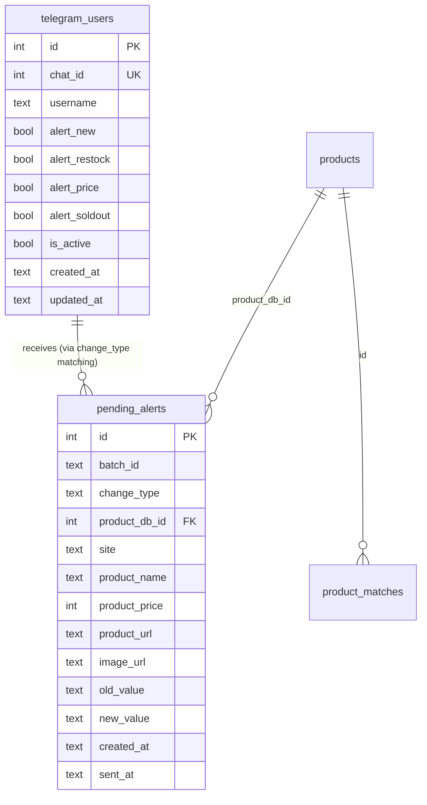

# feat: Add Telegram Bot for Figure Price Alerts

## Overview

Build a Telegram bot that sends rich photo alerts (new products, restocks,
price changes, soldouts) to Korean figure collectors. Users configure alert
preferences via `/settings`. The bot runs as a separate process, communicating
with the scraper via a `pending_alerts` DB table.

## Problem Statement

The figure scrapper detects ~20-50 changes per day across 5 sites, but users
must manually check the Streamlit dashboard to see them. There's no push
notification system — users miss restocks and price drops unless they happen
to check at the right time.

## Proposed Solution

A Telegram bot (`python-telegram-bot` v22.x) running as a separate process:
1. Scraper writes detected changes to `pending_alerts` table after each cycle
2. Bot polls the table, formats rich photo messages with cross-site prices
3. Sends alerts to all active users whose preferences match the change type
4. Users manage preferences via inline keyboard toggles

## Technical Approach

### Architecture

```
┌─────────────┐     ┌──────────────┐     ┌─────────────────┐
│   Scraper    │────>│  SQLite DB   │<────│  Telegram Bot   │
│ (scheduler)  │     │              │     │  (separate proc) │
│              │     │ pending_     │     │                  │
│ scrape_all() │     │ alerts       │     │ polls unsent     │
│   ↓          │     │ telegram_    │     │ alerts, sends    │
│ enrich()     │     │ users        │     │ to matching users│
│   ↓          │     │              │     │                  │
│ queue_alerts │     │ products     │     │ handles /start   │
│              │     │ product_     │     │ /settings /help  │
│              │     │ matches      │     │ /status          │
└─────────────┘     └──────────────┘     └─────────────────┘
```

### Critical Design Decisions (from SpecFlow analysis)

1. **`pending_alerts.product_db_id`** references `products.id` (integer PK),
   NOT `products.product_id` (text). Named `product_db_id` to avoid confusion.

2. **`batch_id`** column groups alerts per scrape cycle. The scraper generates
   a batch ID (timestamp-based) and sets it on all alerts in one cycle.

3. **`sent_at`** means "processed by bot." Individual user send failures are
   handled by deactivating blocked users and retrying transient errors once.

4. **Pipeline order:** `scrape_all()` → `_post_scrape_enrich()` → `queue_alerts()`
   so cross-site matching data is available when alerts are queued.

5. **`preorder → available`** transitions map to `change_type="restock"` for
   alert purposes. Other generic `"status"` changes are silently dropped.

6. **Summary header threshold:** 3+ changes triggers a summary before details.

7. **Image fallback:** If `sendPhoto` fails (CDN blocking, NULL URL), fall back
   to `sendMessage` with text-only format.

8. **Stale backlog on restart:** If oldest unsent alert is >1 hour old, send a
   single summary message with counts and skip individual messages.

### Implementation Phases

#### Phase 1: Database & Config (foundation)

**Files to modify:**

- [x] `db.py` — Add `telegram_users` and `pending_alerts` tables to SCHEMA
- [x] `config.py` — Add Telegram config constants
- [ ] `.env` — Add `TELEGRAM_BOT_TOKEN`
- [x] `requirements.txt` — Add `python-telegram-bot>=22.0`

**`db.py` — New tables in SCHEMA:**

```sql
CREATE TABLE IF NOT EXISTS telegram_users (
    id INTEGER PRIMARY KEY AUTOINCREMENT,
    chat_id INTEGER UNIQUE NOT NULL,
    username TEXT,
    alert_new BOOLEAN DEFAULT 1,
    alert_restock BOOLEAN DEFAULT 1,
    alert_price BOOLEAN DEFAULT 1,
    alert_soldout BOOLEAN DEFAULT 0,
    is_active BOOLEAN DEFAULT 1,
    created_at TEXT,
    updated_at TEXT
);

CREATE TABLE IF NOT EXISTS pending_alerts (
    id INTEGER PRIMARY KEY AUTOINCREMENT,
    batch_id TEXT NOT NULL,
    change_type TEXT NOT NULL,
    product_db_id INTEGER NOT NULL REFERENCES products(id),
    site TEXT NOT NULL,
    product_name TEXT NOT NULL,
    product_price INTEGER,
    product_url TEXT,
    image_url TEXT,
    old_value TEXT,
    new_value TEXT,
    created_at TEXT NOT NULL,
    sent_at TEXT
);

CREATE INDEX IF NOT EXISTS idx_pending_alerts_unsent
    ON pending_alerts(sent_at) WHERE sent_at IS NULL;
```

Note: `pending_alerts` denormalizes `product_name`, `product_price`, `product_url`,
`image_url` to capture the state at detection time (not send time).

**`config.py` — New constants:**

```python
import os

TELEGRAM_BOT_TOKEN = os.environ.get("TELEGRAM_BOT_TOKEN", "")
TELEGRAM_ENABLED = bool(TELEGRAM_BOT_TOKEN)
DASHBOARD_URL = os.environ.get("DASHBOARD_URL", "")
ALERT_SUMMARY_THRESHOLD = 3
ALERT_STALE_HOURS = 1
```

#### Phase 2: Alert Queue (scraper integration)

**Files to modify:**

- [x] `scraper.py` — Add `queue_alerts()` function, call after enrichment
- [x] `scheduler.py` — Call `queue_alerts()` in `_scrape_job()`
- [x] `detector.py` — Map `preorder→available` to `"restock"` change type

**`scraper.py` — New `queue_alerts()` function:**

```python
def queue_alerts(changes: list):
    """Write detected changes to pending_alerts for the Telegram bot."""
    if not changes:
        return

    from db import get_connection, now_kst
    import uuid

    conn = get_connection()
    batch_id = now_kst().replace(" ", "_") + "_" + uuid.uuid4().hex[:6]

    queued = 0
    for change in changes:
        # Skip generic "status" changes (only new/restock/price/soldout)
        if change.change_type not in ("new", "restock", "price", "soldout"):
            continue

        p = change.product
        # Look up DB id
        row = conn.execute(
            "SELECT id FROM products WHERE site = ? AND product_id = ?",
            (p.site, p.product_id),
        ).fetchone()
        if not row:
            continue

        conn.execute("""
            INSERT INTO pending_alerts
                (batch_id, change_type, product_db_id, site,
                 product_name, product_price, product_url, image_url,
                 old_value, new_value, created_at)
            VALUES (?, ?, ?, ?, ?, ?, ?, ?, ?, ?, ?)
        """, (
            batch_id, change.change_type, row["id"], p.site,
            p.name, p.price, p.url, p.image_url,
            change.old_value, change.new_value, now_kst(),
        ))
        queued += 1

    conn.commit()
    conn.close()
    if queued:
        logger.info(f"=== Queued {queued} alerts (batch {batch_id}) ===")
```

**`scheduler.py` — Integration point (after line 28):**

```python
def _scrape_job():
    changes = scrape_all()
    # ... existing counting ...
    if new > 0:
        _post_scrape_enrich(changes)
    # Queue ALL changes for Telegram (after enrichment)
    from scraper import queue_alerts
    queue_alerts(changes)
```

**`detector.py` — Map preorder→available to restock (line ~143):**

```python
# Before: change_type="status" for preorder→available
# After: change_type="restock" when transitioning TO "available"
if product.status == "available" and old_status != "available":
    changes.append(Change("restock", product, old_status, "available"))
```

#### Phase 3: Telegram Bot Core (new file)

**Files to create:**

- [x] `telegram_bot.py` — Main bot process with commands and alert dispatcher

**`telegram_bot.py` structure:**

```
telegram_bot.py
├── Constants & setup
│   ├── load_dotenv()
│   ├── BOT_TOKEN from config
│   └── Logging setup
├── Command handlers
│   ├── cmd_start(update, context)     — Register user, show welcome
│   ├── cmd_settings(update, context)  — Show toggle keyboard
│   ├── cmd_help(update, context)      — Show commands list
│   ├── cmd_status(update, context)    — Show bot stats
│   └── callback_toggle(update, ctx)   — Handle settings button press
├── Alert formatting
│   ├── format_alert_caption(alert, cross_prices) → str
│   ├── format_summary_message(alerts) → str
│   └── get_cross_site_prices(product_db_id) → list[dict]
├── Alert dispatcher
│   ├── process_pending_alerts(context)
│   │   ├── Check for stale backlog on first run
│   │   ├── Poll pending_alerts WHERE sent_at IS NULL
│   │   ├── Group by batch_id
│   │   ├── For each batch:
│   │   │   ├── Get matching users per change_type
│   │   │   ├── If len(batch) >= 3: send summary header
│   │   │   ├── Send individual photo messages
│   │   │   └── Mark sent_at on each alert
│   │   └── Handle errors (Forbidden → deactivate, retry transient once)
│   └── cleanup_old_alerts(context) — Delete sent alerts >7 days old
├── main()
│   ├── Application.builder().token(TOKEN).build()
│   ├── Add command handlers
│   ├── Add callback query handler
│   ├── Add job_queue jobs:
│   │   ├── process_pending_alerts — every 30 seconds
│   │   └── cleanup_old_alerts — daily
│   └── app.run_polling()
```

**Key implementation details:**

Command handlers — Korean UI:
- `/start` welcome message with current settings
- `/settings` inline keyboard:
  ```
  🆕 신규 상품: ✅
  🔄 재입고: ✅
  💰 가격 변동: ✅
  ❌ 품절: ❌
  ```
- Callback data format: `toggle_{alert_type}` (e.g., `toggle_new`)

Alert formatting — HTML parse mode:
```html
🆕 <b>신규 상품</b>

<b>넨도로이드 아크나이츠 W</b>

💰 ₩52,000
🏪 피규어프레소
📦 예약중

🔗 <b>다른 사이트 가격:</b>
 · 매니아하우스: ₩54,800
 · 따빼몰: ₩51,200
```

Inline keyboard buttons per alert:
- `[상품 보기]` → product URL
- `[대시보드]` → dashboard URL (if configured)

Alert dispatcher polling:
- Uses `python-telegram-bot`'s `JobQueue` (built on APScheduler)
- `job_queue.run_repeating(process_pending_alerts, interval=30)`
- On each run: query unsent alerts, group by batch, send to matching users
- Rate limiting: 0.05s delay between messages (20/sec, under Telegram's 30/sec limit)

Error handling:
- `telegram.error.Forbidden` → set `is_active=0` for that user
- `telegram.error.TimedOut` / `telegram.error.NetworkError` → retry once after 5s
- `sendPhoto` failure → fallback to `sendMessage` (text-only)
- Any other error → log and mark alert as sent (don't block queue)

Stale backlog (on startup):
- Check oldest unsent alert's `created_at`
- If older than `ALERT_STALE_HOURS` (default 1h):
  - Count by change_type
  - Send one summary: "⏰ 봇이 오프라인 동안 N개의 알림이 있었습니다."
  - Mark all stale alerts as sent

#### Phase 4: Testing & Polish

- [x] Test `/start` — new user, returning user, reactivated user
- [x] Test `/settings` — toggle each type, verify DB updates
- [x] Test alert pipeline — manually insert into `pending_alerts`, verify bot sends
- [x] Test edge cases:
  - NULL image_url → text fallback
  - NULL product_url → omit button
  - No matching group → no cross-site section
  - Large batch (20+ changes) → summary + individual
  - Stale backlog → summary only
- [x] Test error handling — simulate blocked user, API timeout
- [x] Caption length check — ensure all formats stay under 1024 chars

## ERD: New Tables



## File Summary

| File | Action | Description |
|------|--------|-------------|
| `db.py` | Modify | Add `telegram_users` + `pending_alerts` tables to SCHEMA |
| `config.py` | Modify | Add `TELEGRAM_BOT_TOKEN`, `DASHBOARD_URL`, alert constants |
| `detector.py` | Modify | Map `preorder→available` to `"restock"` change type |
| `scraper.py` | Modify | Add `queue_alerts()`, call in `main()` one-shot path |
| `scheduler.py` | Modify | Call `queue_alerts()` in `_scrape_job()` |
| `telegram_bot.py` | Create | Main bot: commands, formatting, alert dispatcher |
| `requirements.txt` | Modify | Add `python-telegram-bot>=22.0` |
| `.env` | Modify | Add `TELEGRAM_BOT_TOKEN`, `DASHBOARD_URL` |

## Acceptance Criteria

### Functional
- [ ] Bot responds to `/start` with Korean welcome message and registers user
- [ ] `/settings` shows inline keyboard; toggles update DB and refresh message
- [ ] `/help` shows available commands in Korean
- [ ] `/status` shows product count, site count, last scrape time
- [ ] New products trigger photo alerts to users with `alert_new=1`
- [ ] Restocks (including preorder→available) trigger alerts to `alert_restock=1` users
- [ ] Price changes trigger alerts to `alert_price=1` users
- [ ] Soldouts trigger alerts to `alert_soldout=1` users
- [ ] Alerts include cross-site price comparison when product has matching group
- [ ] 3+ changes in a batch produce a summary header before individual messages
- [ ] Alert messages include inline keyboard with product link (+ dashboard if configured)

### Non-Functional
- [ ] Bot process runs independently from scraper process
- [ ] SQLite concurrent access works (WAL mode, no deadlocks)
- [ ] Blocked users auto-deactivated (no repeated send failures)
- [ ] Stale alerts (>1h) summarized instead of flooding
- [ ] Old sent alerts cleaned up after 7 days
- [ ] No DRY violations — bot imports from existing modules, no duplicated logic

## Dependencies

- `python-telegram-bot>=22.0` (new dependency)
- Existing: `sqlite3`, `config.py`, `db.py`, `analytics/matching.py`
- Telegram Bot token (create via @BotFather)

## Risk Analysis

| Risk | Likelihood | Impact | Mitigation |
|------|-----------|--------|------------|
| Cafe24 CDN blocks Telegram image fetch | Medium | Low | Fallback to text-only messages |
| Telegram rate limiting with many users | Low (MVP) | Medium | 0.05s delay between sends |
| SQLite lock contention (scraper + bot) | Low | Medium | WAL mode already enabled |
| Bot token leaked in git | Low | High | Already in .env (gitignored) |

## References

- Brainstorm: `docs/brainstorms/2026-02-19-telegram-bot-brainstorm.md`
- Learning (DRY): `docs/solutions/logic-errors/duplicated-logic-in-scripts.md`
- Learning (CDN): `docs/solutions/integration-issues/cdn-caching-duplicate-jan-codes.md`
- Change detector: `detector.py:21-26` (Change dataclass)
- Scrape job hook: `scheduler.py:14-30` (_scrape_job)
- Matching data: `analytics/matching.py:177-194` (get_saved_matches)
- DB schema: `db.py:17-85` (SCHEMA)
- python-telegram-bot docs: https://python-telegram-bot.readthedocs.io/
