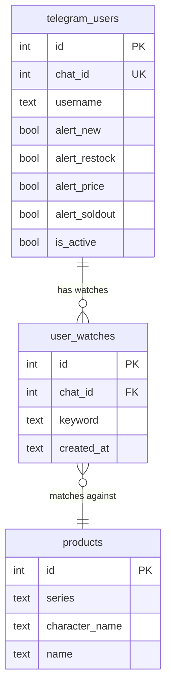

# feat: Add Character/Series Watch Alerts

## Overview

Users can subscribe to specific characters or series via `/watch <keyword>` in the Telegram bot. When watches are set, alerts are filtered to only send products matching at least one keyword. Users with no watches continue to receive all alerts (backward compatible). Keywords match against structured fields (`series`, `character_name`) first, then fall back to raw `product_name` substring.

## Problem Statement

Currently the bot sends ALL detected changes (new/restock/soldout/price) to every user who has that alert type enabled. With ~20-50 changes per day across 5 sites, users get flooded with alerts for products they don't care about. Users want to receive only alerts for characters/series they actually collect.

## Proposed Solution

Simple keyword-based watch system — no series vs character type distinction:
1. `/watch 원신` adds "원신" to the user's watch list (max 10)
2. Alert dispatch checks watches: no watches = get everything, has watches = filter
3. Matching: structured fields first (`series`, `character_name`), then `product_name` substring fallback
4. Matched alerts show a `🔔 <keyword>` tag at the top of the caption

## Technical Approach

### Schema Change

New `user_watches` table added to `SCHEMA` in `db.py`:

```sql
CREATE TABLE IF NOT EXISTS user_watches (
    id INTEGER PRIMARY KEY AUTOINCREMENT,
    chat_id INTEGER NOT NULL,
    keyword TEXT NOT NULL,
    created_at TEXT NOT NULL,
    UNIQUE(chat_id, keyword)
);
```

**db.py:17** — Add this table definition to the `SCHEMA` string, after the `telegram_users` table.

No migration function needed — `CREATE TABLE IF NOT EXISTS` handles new deployments and existing DBs.

### ERD



### Implementation Phases

#### Phase 1: Database + Watch CRUD helpers (`db.py` or inline in `telegram_bot.py`)

Since watch helpers are tightly coupled to the bot (no other consumer), add them directly in `telegram_bot.py` alongside existing DB helpers like `_get_or_create_user`, `_toggle_alert`, etc.

New helper functions in `telegram_bot.py`:

```python
# telegram_bot.py — new DB helper functions

def _add_watch(conn: sqlite3.Connection, chat_id: int, keyword: str) -> str:
    """Add a watch keyword. Returns: 'added', 'exists', 'limit'."""
    keyword = keyword.strip().lower()
    count = conn.execute(
        "SELECT COUNT(*) FROM user_watches WHERE chat_id = ?", (chat_id,)
    ).fetchone()[0]
    if count >= 10:
        return "limit"
    try:
        conn.execute(
            "INSERT INTO user_watches (chat_id, keyword, created_at) VALUES (?, ?, ?)",
            (chat_id, keyword, now_kst()),
        )
        conn.commit()
        return "added"
    except sqlite3.IntegrityError:
        return "exists"


def _remove_watch(conn: sqlite3.Connection, chat_id: int, watch_id: int) -> bool:
    """Remove a watch by id. Returns True if deleted."""
    result = conn.execute(
        "DELETE FROM user_watches WHERE id = ? AND chat_id = ?",
        (watch_id, chat_id),
    )
    conn.commit()
    return result.rowcount > 0


def _remove_watch_by_keyword(conn: sqlite3.Connection, chat_id: int, keyword: str) -> bool:
    """Remove a watch by keyword text. Returns True if deleted."""
    keyword = keyword.strip().lower()
    result = conn.execute(
        "DELETE FROM user_watches WHERE chat_id = ? AND keyword = ?",
        (chat_id, keyword),
    )
    conn.commit()
    return result.rowcount > 0


def _get_watches(conn: sqlite3.Connection, chat_id: int) -> list[dict]:
    """Get all watches for a user."""
    rows = conn.execute(
        "SELECT id, keyword FROM user_watches WHERE chat_id = ? ORDER BY id",
        (chat_id,),
    ).fetchall()
    return [dict(r) for r in rows]


def _get_watch_count(conn: sqlite3.Connection, chat_id: int) -> int:
    """Get number of watches for a user."""
    return conn.execute(
        "SELECT COUNT(*) FROM user_watches WHERE chat_id = ?", (chat_id,)
    ).fetchone()[0]
```

**Key decisions:**
- Keywords normalized to lowercase at storage time (UNIQUE constraint handles dedup)
- `_remove_watch` uses integer `id` (for callback buttons — Telegram's 64-byte callback_data limit)
- `_remove_watch_by_keyword` used for `/unwatch <keyword>` text command

#### Phase 2: Bot Command Handlers (`telegram_bot.py`)

Three new command handlers + one callback handler:

##### `/watch <keyword>` handler

```python
# telegram_bot.py — after existing command handlers (~line 365)

async def cmd_watch(update: Update, context: ContextTypes.DEFAULT_TYPE) -> None:
    """Handle /watch <keyword> — add a watch keyword."""
    conn = get_connection()
    _get_or_create_user(conn, update.effective_chat.id, update.effective_user.username)

    keyword = " ".join(context.args) if context.args else ""
    if not keyword.strip():
        conn.close()
        await update.message.reply_text(
            "아, 저기... 키워드를 알려주셔야 해요...!\n"
            "사용법: /watch 원신 또는 /watch 하츠네 미쿠",
            parse_mode=ParseMode.HTML,
        )
        return

    keyword = keyword.strip()
    if len(keyword) < 2:
        conn.close()
        await update.message.reply_text(
            "아, 저기... 2글자 이상으로 입력해주시면...!",
            parse_mode=ParseMode.HTML,
        )
        return

    result = _add_watch(conn, update.effective_chat.id, keyword)
    count = _get_watch_count(conn, update.effective_chat.id)
    conn.close()

    if result == "added":
        await update.message.reply_text(
            f'저, 저기... "{_escape_html(keyword)}" 추가했어요...! '
            f"이제 관련 상품이 나오면 바로 알려드릴게요...!\n"
            f"📋 현재 관심 목록: {count}/10개",
            parse_mode=ParseMode.HTML,
        )
    elif result == "exists":
        await update.message.reply_text(
            "아, 그건 이미 목록에 있어요...! 걱정 마세요, 잘 지켜보고 있을게요...!",
            parse_mode=ParseMode.HTML,
        )
    elif result == "limit":
        await update.message.reply_text(
            "죄, 죄송해요... 관심 목록이 가득 찼어요... (10/10개)\n"
            "/mywatches에서 안 보는 키워드를 지워주시면...!",
            parse_mode=ParseMode.HTML,
        )
```

##### `/unwatch <keyword>` handler

```python
async def cmd_unwatch(update: Update, context: ContextTypes.DEFAULT_TYPE) -> None:
    """Handle /unwatch <keyword> — remove a watch keyword."""
    conn = get_connection()
    _get_or_create_user(conn, update.effective_chat.id, update.effective_user.username)

    keyword = " ".join(context.args) if context.args else ""
    if not keyword.strip():
        conn.close()
        await update.message.reply_text(
            "아, 저기... 삭제할 키워드를 알려주셔야 해요...!\n"
            "사용법: /unwatch 원신",
            parse_mode=ParseMode.HTML,
        )
        return

    removed = _remove_watch_by_keyword(conn, update.effective_chat.id, keyword.strip())
    count = _get_watch_count(conn, update.effective_chat.id)
    conn.close()

    if removed:
        await update.message.reply_text(
            f'"{_escape_html(keyword.strip())}" 삭제했어요...! 📋 남은 관심 목록: {count}/10개',
            parse_mode=ParseMode.HTML,
        )
    else:
        await update.message.reply_text(
            "어, 그 키워드는 목록에 없는 것 같은데... /mywatches에서 확인해보실래요...?",
            parse_mode=ParseMode.HTML,
        )
```

##### `/mywatches` handler

```python
async def cmd_mywatches(update: Update, context: ContextTypes.DEFAULT_TYPE) -> None:
    """Handle /mywatches — show current watches with remove buttons."""
    conn = get_connection()
    _get_or_create_user(conn, update.effective_chat.id, update.effective_user.username)
    watches = _get_watches(conn, update.effective_chat.id)
    conn.close()

    if not watches:
        await update.message.reply_text(
            "아, 아직 관심 목록이 비어있어요...\n"
            "/watch 원신 이렇게 추가해주시면... 관련 상품만 알려드릴게요...!\n"
            "관심 목록이 없으면 모든 알림을 보내드려요...!",
            parse_mode=ParseMode.HTML,
        )
        return

    buttons = []
    for w in watches:
        buttons.append([InlineKeyboardButton(
            f"❌ {w['keyword']}",
            callback_data=f"unwatch_{w['id']}",
        )])
    keyboard = InlineKeyboardMarkup(buttons)

    await update.message.reply_text(
        f"📋 저, 저한테 맡겨주신 관심 목록이에요...! ({len(watches)}/10개)\n"
        "버튼을 누르면 삭제할 수 있어요...",
        parse_mode=ParseMode.HTML,
        reply_markup=keyboard,
    )
```

##### Callback handler for watch removal

```python
async def callback_unwatch(update: Update, context: ContextTypes.DEFAULT_TYPE) -> None:
    """Handle inline button press to remove a watch."""
    query = update.callback_query
    await query.answer()

    data = query.data
    if not data or not data.startswith("unwatch_"):
        return

    try:
        watch_id = int(data.replace("unwatch_", ""))
    except ValueError:
        return

    conn = get_connection()
    removed = _remove_watch(conn, update.effective_chat.id, watch_id)
    watches = _get_watches(conn, update.effective_chat.id)
    conn.close()

    if not watches:
        await query.edit_message_text(
            "📋 관심 목록이 비었어요...!\n"
            "이제 모든 알림을 보내드릴게요...!",
            parse_mode=ParseMode.HTML,
        )
        return

    # Rebuild keyboard with remaining watches
    buttons = []
    for w in watches:
        buttons.append([InlineKeyboardButton(
            f"❌ {w['keyword']}",
            callback_data=f"unwatch_{w['id']}",
        )])
    keyboard = InlineKeyboardMarkup(buttons)

    await query.edit_message_text(
        f"📋 저, 저한테 맡겨주신 관심 목록이에요...! ({len(watches)}/10개)\n"
        "버튼을 누르면 삭제할 수 있어요...",
        parse_mode=ParseMode.HTML,
        reply_markup=keyboard,
    )
```

**Callback data format:** `unwatch_<integer_id>` — uses the `user_watches.id` integer PK (max ~10 chars total, well within Telegram's 64-byte limit).

##### Register handlers and BotCommand menu

**telegram_bot.py:612-618** — Update `post_init` to include new commands:

```python
async def post_init(application: Application) -> None:
    await application.bot.set_my_commands([
        BotCommand("start", "봇 시작 및 등록"),
        BotCommand("settings", "알림 설정 변경"),
        BotCommand("watch", "관심 키워드 추가"),
        BotCommand("unwatch", "관심 키워드 삭제"),
        BotCommand("mywatches", "관심 목록 보기"),
        BotCommand("status", "봇 현황 확인"),
        BotCommand("help", "도움말 보기"),
    ])
```

**telegram_bot.py:622-629** — Register new handlers:

```python
app.add_handler(CommandHandler("watch", cmd_watch))
app.add_handler(CommandHandler("unwatch", cmd_unwatch))
app.add_handler(CommandHandler("mywatches", cmd_mywatches))
app.add_handler(CallbackQueryHandler(callback_unwatch, pattern="^unwatch_"))
```

##### Update `/help` command

**telegram_bot.py:333-343** — Add watch commands to help text:

```python
"/watch 원신 — 관, 관심 키워드를 추가할 수 있어요...\n"
"/unwatch 원신 — 관심 키워드를 삭제해요...\n"
"/mywatches — 관, 관심 목록을 볼 수 있어요...\n"
```

#### Phase 3: Watch-Aware Alert Dispatch (`telegram_bot.py`)

This is the core filtering logic. Modify `process_pending_alerts` to check user watches.

##### New matching helper

```python
def _matches_watch(keyword: str, series: str | None, character_name: str | None, product_name: str) -> bool:
    """Check if a watch keyword matches a product. Case-insensitive substring."""
    kw = keyword  # already lowercase from storage
    if series and kw in series.lower():
        return True
    if character_name and kw in character_name.lower():
        return True
    if kw in product_name.lower():
        return True
    return False
```

##### Preload watches for the dispatch cycle

At the start of `process_pending_alerts` (after getting `conn`), load all watches once:

```python
# Preload all user watches {chat_id: [keyword, ...]}
watch_rows = conn.execute(
    "SELECT chat_id, keyword FROM user_watches"
).fetchall()
user_watches: dict[int, list[str]] = {}
for wr in watch_rows:
    user_watches.setdefault(wr["chat_id"], []).append(wr["keyword"])
```

##### Filter in the normal per-alert send loop

**telegram_bot.py:511-571** — In the per-alert loop, after getting `target_users`, filter by watches:

```python
for alert in alerts:
    target_users = type_to_users.get(alert["change_type"], [])
    if not target_users:
        # ... mark as sent (existing code)
        continue

    # Load product structured fields for watch matching
    prod_row = conn.execute(
        "SELECT series, character_name FROM products WHERE id = ?",
        (alert["product_db_id"],),
    ).fetchone()
    p_series = prod_row["series"] if prod_row else None
    p_char = prod_row["character_name"] if prod_row else None
    p_name = alert["product_name"]

    cross_prices, suspicious_match = _get_cross_site_prices(conn, alert["product_db_id"])

    for chat_id in target_users:
        # Watch filtering
        watches = user_watches.get(chat_id, [])
        matched_keyword = None
        if watches:
            for kw in watches:
                if _matches_watch(kw, p_series, p_char, p_name):
                    matched_keyword = kw
                    break
            if matched_keyword is None:
                continue  # User has watches but none matched — skip

        caption = _format_alert_caption(alert, cross_prices, suspicious_match, matched_keyword)
        keyboard = _build_alert_keyboard(alert)
        # ... send logic (existing code, unchanged)
```

**Key change**: The inner loop moves from "for each alert, send to all target_users" to "for each alert, for each target_user, check watches then send." This means `_format_alert_caption` and `_build_alert_keyboard` are called once per alert (outside the per-user loop only if no watches exist), or the caption varies per user (when watch tag differs). For simplicity and since user count is small, compute caption per-user only when needed.

**Optimization**: Since most users will either all have no watches or have the same match result, we can precompute:

```python
# Group users by their matched keyword (or None for no-watch users)
user_match_groups: dict[str | None, list[int]] = {}
for chat_id in target_users:
    watches = user_watches.get(chat_id, [])
    if not watches:
        user_match_groups.setdefault(None, []).append(chat_id)
    else:
        matched = None
        for kw in watches:
            if _matches_watch(kw, p_series, p_char, p_name):
                matched = kw
                break
        if matched is not None:
            user_match_groups.setdefault(matched, []).append(chat_id)
        # else: skip — user has watches but none matched

# Send per group (one caption per keyword variant)
for matched_kw, group_users in user_match_groups.items():
    caption = _format_alert_caption(alert, cross_prices, suspicious_match, matched_kw)
    keyboard = _build_alert_keyboard(alert)
    for chat_id in group_users:
        # ... existing send logic
```

##### Update `_format_alert_caption` signature

**telegram_bot.py:172** — Add `matched_keyword` parameter:

```python
def _format_alert_caption(
    alert: dict,
    cross_prices: list[dict],
    suspicious_match: bool = False,
    matched_keyword: str | None = None,
) -> str:
    """Format an alert into an HTML caption for Telegram."""
    change_type = alert["change_type"]
    header = ALERT_TYPES.get(change_type, {}).get("label", change_type)
    site_name = SITE_NAMES.get(alert["site"], alert["site"])

    lines = []
    if matched_keyword:
        lines.append(f"🔔 {_escape_html(matched_keyword)}\n")
    lines.append(f"{header}\n")
    # ... rest unchanged
```

##### Stale backlog path

**telegram_bot.py:406-448** — The stale-backlog summary path sends a plain-text count summary to ALL active users. For MVP, keep this as-is — it's a rare edge case (bot was offline for hours) and the summary is not per-product, so watch filtering doesn't meaningfully apply. The summary just says "X new, Y restock..." without product details.

No change needed for the stale path.

### File Change Summary

| File | Changes |
|------|---------|
| `db.py:17` (SCHEMA) | Add `user_watches` table definition |
| `telegram_bot.py:~60` | Add `_add_watch`, `_remove_watch`, `_remove_watch_by_keyword`, `_get_watches`, `_get_watch_count` helpers |
| `telegram_bot.py:~365` | Add `cmd_watch`, `cmd_unwatch`, `cmd_mywatches` command handlers |
| `telegram_bot.py:~390` | Add `callback_unwatch` callback handler |
| `telegram_bot.py:172` | Update `_format_alert_caption` — add `matched_keyword` param + watch tag |
| `telegram_bot.py:333` | Update `cmd_help` — add watch command descriptions |
| `telegram_bot.py:397` | Update `process_pending_alerts` — preload watches, add `_matches_watch`, filter per-user |
| `telegram_bot.py:612` | Update `post_init` — add watch/unwatch/mywatches to BotCommand menu |
| `telegram_bot.py:622` | Register new command + callback handlers |

## Acceptance Criteria

### Functional

- [x] `/watch 원신` adds keyword to user's watch list (lowercase, 2+ chars, max 10)
- [x] `/watch` with no arg shows usage hint
- [x] `/watch` with 1-char keyword shows min-length error
- [x] `/watch` when at 10 watches shows limit error
- [x] `/watch` for existing keyword shows "already exists" message
- [x] `/unwatch 원신` removes keyword from watch list
- [x] `/unwatch` for non-existent keyword shows "not found" message
- [x] `/mywatches` shows all keywords with inline ❌ remove buttons
- [x] `/mywatches` with empty list shows guidance message
- [x] Tapping ❌ button removes watch and updates the message in-place
- [x] Users with no watches receive all alerts (backward compatible)
- [x] Users with watches receive only alerts matching at least one keyword
- [x] Match priority: `series` → `character_name` → `product_name` (case-insensitive substring)
- [x] Matched alerts show `🔔 <keyword>` tag at top of caption
- [x] Existing alert type toggles (`/settings`) still work — watches are additive
- [x] Stale-backlog summary still sends to all active users (no watch filtering)

### Non-Functional

- [x] Watch preload is done once per dispatch cycle (not per-alert)
- [x] No N+1 queries — product series/character loaded once per alert, not per user
- [x] New table uses `CREATE TABLE IF NOT EXISTS` (safe for existing DBs)
- [x] All bot messages follow shy Korean personality

## Dependencies & Risks

- **Low risk**: Feature is additive — users with no watches are completely unaffected
- **Low risk**: Schema change is a new table only, no existing table alterations
- **Edge case**: Products with no extraction (`series`/`character_name` both NULL) can still match via `product_name` fallback
- **Edge case**: CDN-corrupted `product_name` in `pending_alerts` — matching uses `alert["product_name"]` which is a snapshot, but this is acceptable (same text user would see in the alert anyway)

## References

- Brainstorm: `docs/brainstorms/2026-02-20-character-watch-alerts-brainstorm.md`
- Telegram bot: `telegram_bot.py` (all changes in this file + schema in `db.py`)
- Existing patterns: `_toggle_alert` (line 92), `callback_toggle` (line 368), `_build_settings_keyboard` (line 273)
- Documented learning: `docs/solutions/infrastructure/hetzner-vps-deployment.md` (deploy = git pull + restart)
- Documented learning: `docs/solutions/cafe24-cdn-duplicate-products.md` (product_name is a CDN snapshot)
